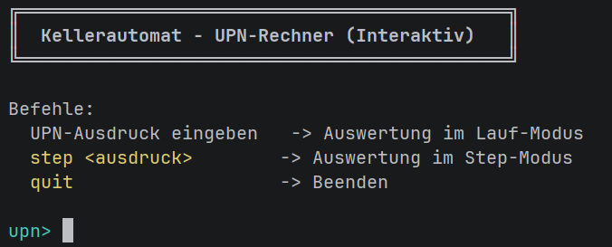
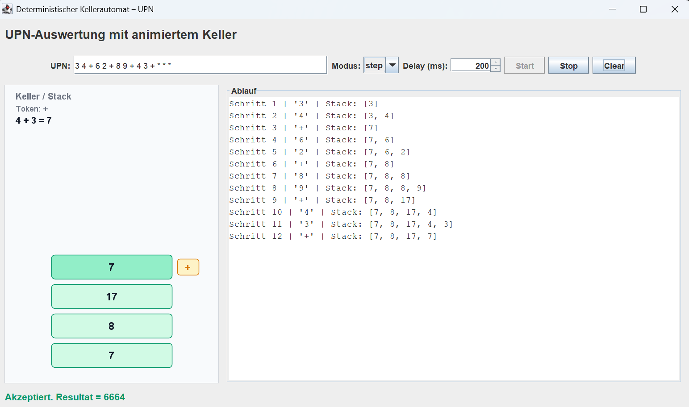

# Kellerautomat – UPN-Rechner

Deterministischer Kellerautomat zur Auswertung von **UPN** (Umgekehrte Polnische Notation) mit grafischer und textueller Darstellung.

Ein Lehrbespiel-Projekt zum Verständnis von **Kellerautomaten** und deren Funktionsweise. Die Anwendung ermöglicht es, mathematische Ausdrücke in UPN schrittweise zu verarbeiten und die Stack-Operationen visuell nachzuvollziehen.
## Interfaces
### CLI


### GUI


## Features

- Eigener Stack (`IntStack`) – kein `java.util.Stack`
- Operatoren `+` und `*`
- Kompakte Eingabe (`23+4*`) und Token-Eingabe mit mehrstelligen Zahlen (`31 78 + 1214 +`)
- **CLI Modi:**
  - Step-Modus: 1 Sekunde Pause pro Berechnungsschritt (ideal zum Nachvollziehen)
  - Lauf-Modus: Alle Schritte sofort hintereinander
  - Interaktive CLI
- **GUI** mit animierter Stack-Darstellung (Swing-basiert)

## Voraussetzungen

- Java Development Kit (JDK) 8 oder höher
- Terminal/Konsole für Kompilierung

## Klassen

| Package | Datei | Beschreibung |
|---|---|---|
| `pda` | `IntStack` | Eigener Keller/Stack |
| `pda` | `UpnEvaluator` | PDA-Logik |
| `pda` | `EvaluationStep` | Ein Berechnungsschritt |
| `pda` | `EvaluationResult` | Ergebnis (akzeptiert/abgelehnt) |
| `ui` | `PdaGui` | Swing-GUI |
| `ui` | `StackPanel` | Animierte Stack-Zeichnung |
| `ui` | `StackAnimationPlayer` | Zeitsteuerung der Animation |
| – | `Main` | Einstiegspunkt |

## Starten

**Compile:**
```powershell
javac -encoding UTF-8 -d out src\Main.java src\pda\*.java src\ui\*.java
```

**Run:**

### GUI (Standard)
```powershell
java -cp out Main
```
Startet das grafische Interface mit animierter Stack-Visualisierung.

### CLI Modes

#### Step-Modus (mit Pausen)
```powershell
java -cp out Main step "3 4 + 2 *"
```
Berechnet UPN-Ausdrücke schrittweise mit 1 Sekunde Pause zwischen den Schritten. Perfekt zum Lernen!

#### Lauf-Modus (direkt)
```powershell
java -cp out Main lauf "3 4 + 2 *"
```
Führt alle Schritte direkt hintereinander aus und zeigt nur das Endergebnis.

#### Interaktiver Modus
```powershell
java -cp out Main cli
```
Eingabe von Ausdrücken in der interaktiven Kommandozeile.

#### Test
```powershell
java -cp out Main test
```
Führt vordefinierte Test-Ausdrücke aus.

## Screenshots & Beispiele

### GUI
Das grafische Interface zeigt die animierte Stack-Visualisierung. Mit jedem Verarbeitungsschritt wird der Stack aktualisiert.

**Beispielausdruck:** `3 4 + 2 *` = 14

### CLI Step-Modus Output
```
Eingabe: 3 4 + 2 *
Schritt 1: Zahl 3      | Stack: [3]
Schritt 2: Zahl 4      | Stack: [3, 4]
Schritt 3: + Operation | Stack: [7]
Schritt 4: Zahl 2      | Stack: [7, 2]
Schritt 5: * Operation | Stack: [14]
Ergebnis: 14 ✓ AKZEPTIERT
```
